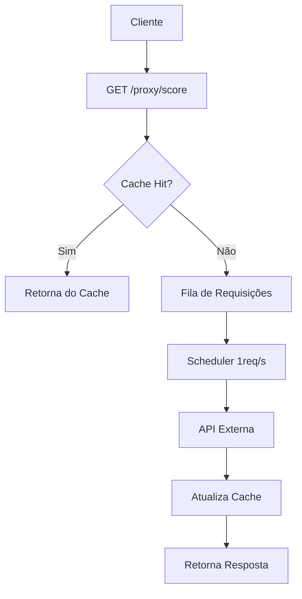

# 🔄 Proxy Interno para API de Score

[](https://python.org)
[](https://fastapi.tiangolo.com)

Um proxy resiliente e inteligente para consumir a API de score externa com gestão automática de rate limiting (1 req/s), cache e fila de requisições.

## ✨ Funcionalidades

- 🚦 **Rate Limiting Inteligente** - Respeita o limite de 1 requisição/segundo da API externa
- 💾 **Cache em Memória** - Memoriza respostas recentes para evitar chamadas desnecessárias
- 🎯 **Fila com Backpressure** - Gerencia picos de até 20 requisições simultâneas
- 📊 **Métricas em Tempo Real** - Monitoramento do status da fila, cache e sistema
- 🔒 **Singleton Pattern** - Garante uma única instância do rate limiter e fila
- 🎨 **Decorator Pattern** - Cache automático com decorators elegantes

## 🏗️ Arquitetura



## 📦 Estrutura do Projeto

```
proxy-score-api/
├── api/
│   └── score_api.py          # Integração com API externa
├── utils/
│   ├── rate_limiter.py       # Singleton para rate limiting
│   ├── cache.py              # Decorator pattern para cache
│   └── request_queue.py      # Fila com threading
├── app.py                    # Aplicação FastAPI
├── main.py                   # Ponto de entrada
├── test_burst.py             # Teste de carga
└── requirements.txt          # Dependências
```

## 🚀 Começando Rapidamente

### Pré-requisitos

- Python 3.8+
- pip (gerenciador de pacotes)

### Instalação

```bash
# 1. Clone o repositório
git clone https://github.com/seu-usuario/proxy-score-api.git
cd proxy-score-api

# 2. Instale as dependências
pip install -r requirements.txt

# 3. Execute a aplicação
python main.py

# Em outro terminal, teste
python test_server.py
python test_burst.py
```

### Uso Básico

```bash
# Fazer uma consulta de score
curl "http://localhost:8000/proxy/score?cpf=12345678900&client_id=seu_client_id"

# Verificar saúde da aplicação
curl http://localhost:8000/health

# Consultar métricas
curl http://localhost:8000/metrics
```

## 📡 Endpoints da API

### `GET /proxy/score`
Consulta o score de um CPF na API externa.

**Parâmetros:**
- `cpf` (string, obrigatório): CPF a ser consultado (11 dígitos)
- `client_id` (string, obrigatório): Client ID para autenticação na API externa

**Exemplo:**
```bash
curl "http://localhost:8000/proxy/score?cpf=03930956144&client_id=000"
```

### `GET /health`
Endpoint de health check para verificar se o serviço está operacional.

**Resposta:**
```json
{
  "status": "healthy"
}
```

### `GET /metrics`
Endpoint de métricas para monitoramento do sistema.

**Resposta:**
```json
{
  "queue_size": 0,
  "cache_size": 5,
  "processing": false,
  "system_status": "operational"
}
```

## 🧪 Testes

### Teste de Carga
Simula 20 requisições simultâneas para validar a resiliência do proxy:

```bash
python test_burst.py
```

**Saída esperada:**
```
Tempo total: 20.15s
Requisições/s: 0.99
Sucessos: 20/20
```

### Teste Manual
```python
import requests

response = requests.get(
    "http://localhost:8000/proxy/score",
    params={"cpf": "03930956144", "client_id": "000"}
)
print(response.json())
```

## ⚙️ Configuração

### Variáveis de Ambiente

| Variável | Descrição | Padrão |
|----------|-----------|--------|
| `CLIENT_ID` | Client ID para API externa | - |

### Exemplo de Configuração

```bash
# Linux/Mac
export CLIENT_ID="seu_client_id_aqui"

# Windows (PowerShell)
$env:CLIENT_ID="seu_client_id_aqui"

# Windows (CMD)
set CLIENT_ID=seu_client_id_aqui
```

## 🎯 Padrões de Projeto Implementados

### Singleton
```python
# Garante uma única instância do rate limiter
class RateLimiter:
    _instance = None
    
    def __new__(cls):
        if cls._instance is None:
            cls._instance = super().__new__(cls)
        return cls._instance
```

### Decorator
```python
# Cache automático com decorator
@cached(ttl=300)
def get_score(id_client, cpf):
    # Lógica da função
    return result

- ✅ Seção de agradecimentos

Quer que eu ajuste alguma coisa específica? 😊
